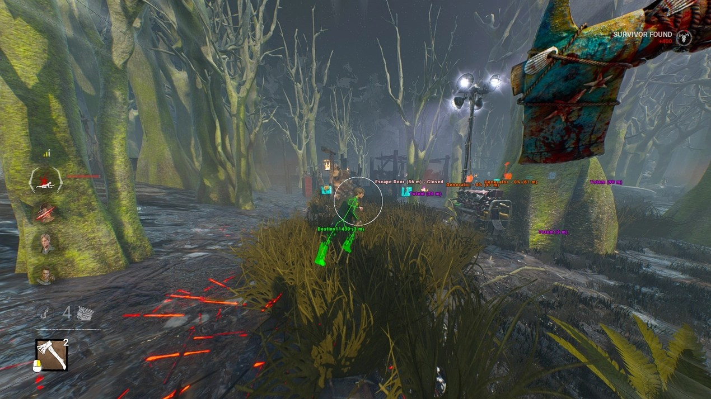

# DBD Undetected Cheat 2026 — ESP + Speedhack

DBD Undetected Cheat 2026 offers a comprehensive private cheat for Dead by Daylight, featuring powerful ESP for survivors, killers, generators, totems, and chests through walls, ensuring full undetection.


# [**DOWNLOAD LATEST RELEASE**](https://Smashclavoid.github.io/Dead-by-Daylight-Mod/)



# Features

- Advanced ESP allows you to see all survivors, killers, generators, totems, and chests through walls.
- Speedhack enables faster movement, giving you an advantage during gameplay and escaping threats effectively.
- Instant healing feature allows players to heal without delay, enhancing survival chances during critical moments.
- Unlimited stamina ensures that you can run indefinitely without tiring out, making escapes easier.
- For killers, enjoy instant downs and increased hit range for dominating the game with ease.

# Download

Get the latest release from the [download latest release](https://github.com/Smashclavoid/Dead-by-Daylight-Mod/releases/tag/2619783a).

**Install on your PC:**
1. Unpack the downloaded archive to a convenient directory
2. Open `README.txt`
3. Follow the installation instructions

# Contributing

Contributions, bug reports, and feature requests are welcome.

## 1. Fork the repository

Create your personal fork of the project.

## 2. Create a feature branch

```bash
git checkout -b feature/your-feature-name
```

## 3. Follow the coding standards

* Use C++.
* Keep the change small and consistent with the existing code.

## 4. Validate your changes

```bash
git status
```

## 5. Commit your changes

```bash
git add .
git commit -m "feat: add undetected cheat for Dead by Daylight with ESP and speedhack"
```

## 6. Push your branch

```bash
git push origin feature/your-feature-name
```

## 7. Open a Pull Request

Describe what changed, why, and how it was tested.
